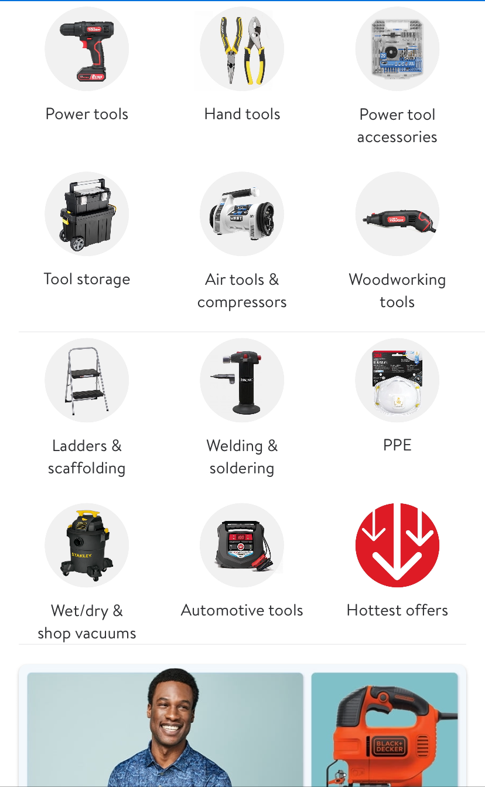
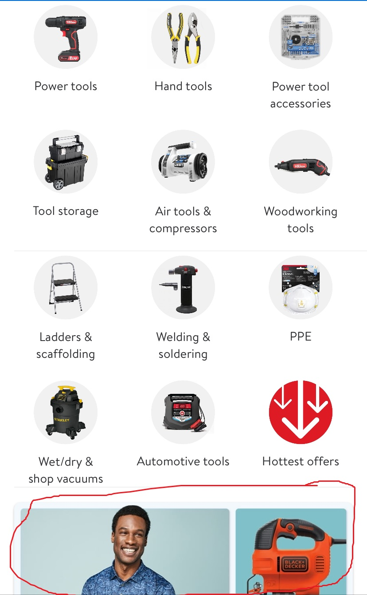

# Home Handyman Portfolio

# Introduction

Welcome to the readme. I wish to make a portfolio which is clear, beautiful and useful. If you have anything to add or change, just come on, and I will give everyone GitHub collaboration authority to change anything!

React Native is based on JavaScript or TypeScript. As a script rather than a programming language, it can render a web page and run dynamically, but can hardly manipulate a database or process complicated interactions. So, I choose just to display beautiful images rather than a giant app.

We have researched Mrapplicance, Walmart and Homedepot applications, and we decided to get the pros of them to our portfolio😉. Time is short, let us do it right now~

# Assignment

## Nie, Yangfei

Home page.

## DI, PAN

Please do the pictures at the bottom of homepage. No limitation, just make it beautiful.

## Categories for all

When a customer clicks one category,e.g. Power tools, I want to jump to a new category page, with pictures and names on the page. Everyone can do one category on the table. Please give a return to home button on the left up.

| Name                           | Category                                                  |
| ------------------------------ | --------------------------------------------------------- |
| Ndruzi, Benjamin               | Power tools                                               |
| Nie, Yangfei                   | Hand tools                                                |
| Pallala, Deekshitha            | Power tool accessories                                    |
| Panchal, Sanskar Umangkumar    | Tool storage                                              |
| Panchal, Vinit Dharmendrakumar | Air tools & compressors                                   |
| Pancholi, Jinal Brijesh        | Woodworking tools                                         |
| Pandya, Shrey Paragkumar       | Ladders & scaffolding                                     |
| Pandya, Shubham Bhupendrakumar | Welding & soldering                                       |
| Parmar, Shrey Yogeshbhai       | PPE                                                       |
| Patange, Tulsi                 | The screenshot is over, you can choose your own category✌ |
